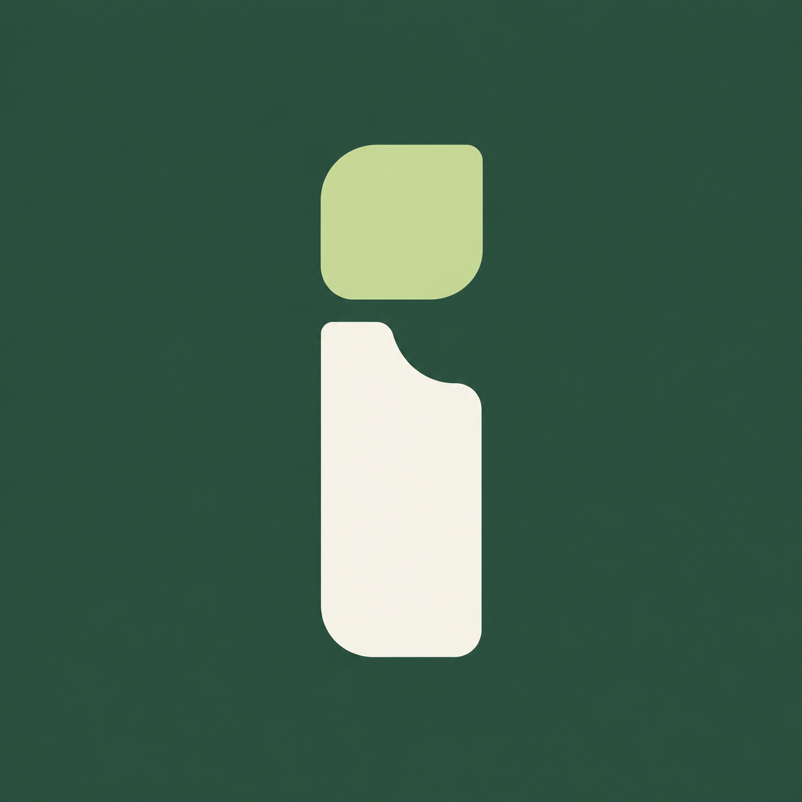

# Interface — local automation workbench



A macOS desktop application for model-guided UI discovery, deterministic browser replay, reviewed submission, and live human intervention. The workbench and Chromium browser run on your laptop. The default integration target is the **Mifos X web app, backed by Apache Fineract**, running locally in Docker. No AWS account, cloud deployment, or separate virtual desktop is needed.

The live Chromium panel displays the actual browser pointer moving between controls, with a pulse on clicks. During takeover, your normal mouse pointer remains available. Pointer telemetry is transient and does not alter target-page content or recorded capability selectors.

The existing **Local Credit Union Lab** remains an explicitly selected synthetic fixture for offline development and fault testing. It is a separate target; its passing tests are not evidence that a Mifos workflow has been qualified. See [the validation record](docs/validation.md) for the tested scope.

Start with [REPORT.md](REPORT.md) for the design decisions and [evidence/](evidence/README.md) for the genuine discovered artifact, zero-model replay and duplicate-reference outcome. See [the assessment-readiness checklist](docs/readiness.md) for remaining handover work and [brand assets](public/brand/README.md) for the Interface identity.

## Set up a fresh checkout

For the desktop app, use **macOS 13 Ventura or newer**. Install Node.js **22.13 or newer**, Google Chrome, and [Docker Desktop](https://docs.docker.com/desktop/). Open Docker Desktop and wait for the engine to start. Initial setup needs **8 GiB free disk**, **8 GiB host RAM**, and **4 GiB allocated to Docker**; 16 GiB host RAM and 8 GiB Docker memory are recommended. Image downloads also need space inside Docker Desktop's disk allocation. Once all pinned images are cached, repeated setup requires **2 GiB free disk** for ongoing operation.

From the cloned repository directory, run:

```sh
npm ci
npm run doctor
npm run setup
npm start
```

`npm run setup` checks prerequisites before downloading images. It preserves an existing `.env`, or creates one from `.env.example` with private file permissions when none exists. It provisions the desktop executable through Electron's official installer, then starts the pinned Mifos stack, waits for both the web app and authenticated Fineract API, and seeds the local fixtures. The Electron step also runs for `--lab`; cached matching binaries are reused, so desktop startup does not require a later binary download. Setup stops on any failed check; it does not silently switch to the lab. The first desktop/container downloads and database initialization can take several minutes.

`npm start` builds the interface and opens the Electron desktop window against the ready Mifos stack. Double-clicking **Start Interface.command** is equivalent. Use `npm run start:web` for the same workbench in a browser at [127.0.0.1:4317](http://127.0.0.1:4317). `CHROME_PATH` can select another installed Chromium executable. Windows packaging and behavior have not been validated.

Closing Interface stops its worker; Mifos containers and their data remain available for the next session. Stop the containers with `node scripts/mifos-stack.mjs down`. After a machine restart, open Docker Desktop and run `npm run setup` again; fixture setup is idempotent. Do not remove Docker volumes when you want to preserve the target's records.

The [fresh-install qualification](docs/fresh-install-qualification.md) exercised an empty database in separate volumes and ports: first seed made 12 writes; repeating setup made zero. Run `npm run test:setup:fresh` to reproduce that check without changing an existing stack. Existing npm/Electron/image caches were reused in the recorded run, so cold-download timing is unmeasured.

## Assessment demo and evidence

The committed [member-discovery evidence](evidence/member-discovery/manifest.json) is from real OpenAI `gpt-4.1` discovery (14 calls) and a different-name/reference replay (zero calls), with a separate approval and one synthetic creation for each. A third replay returned `MEMBER_REFERENCE_EXISTS` before any creation. The contract remains a qualified draft. Open the [artifact](evidence/member-discovery/artifact.json), [schemas](evidence/member-discovery/contract-schemas.json) and redacted [source](evidence/member-discovery/discovery.json)/[replay](evidence/member-discovery/replay.json) logs to inspect the completed path without running a model.

To run that discovery/replay path yourself, first create an entirely fictional isolated target. The following commands use separate database volumes and leave the current workbench alone:

```sh
npm ci
npm run test:setup:fresh
```

The setup check prints the retained checkout path. Set `ASSESSMENT_ENV` to that checkout's `.env`. Add your OpenAI key to your normal project `.env` (preserve existing settings), then run from this source directory:

```sh
ASSESSMENT_ENV="/absolute/path/printed/by/the/setup/check/checkout/.env"
INTERFACE_ENV_FILE="$ASSESSMENT_ENV" INTERFACE_PROVIDER_ENV_FILE="$PWD/.env" npm run test:member:discovery
```

This command runs the goal “Create a new member with first name Jordan and last name Ellis, member reference &lt;fresh reference&gt;, after my approval,” saves its discovered capability, then replays that exact artifact for Casey Morgan with another reference. It uses the normal worker approval endpoint for each exact preview and verifies zero model calls on replay. It sends visible fictional UI data to OpenAI, incurs API charges and retains two synthetic members. The separate provider file supplies only provider settings; it cannot redirect the isolated target. The entire visible member list must be fictional.

For model-free UI validation and real same-session recovery on the same isolated stack:

```sh
INTERFACE_ENV_FILE="$ASSESSMENT_ENV" npm run test:mifos
INTERFACE_ENV_FILE="$ASSESSMENT_ENV" npm run test:mifos:recovery
```

Each harness saves progress under `.local/validation/`. [Export selected fictional runs](evidence/README.md#reproduce-and-export) with `npm run export:evidence -- --help`; export validates provenance and qualification, preserves the original digest, and never starts a worker or calls a provider. The [privacy policy](docs/evidence-privacy.md) explains encrypted operational state versus public evidence. No model key is needed to run the authored desktop replays or the lab tests below.

## Use the local Mifos target

Open [Mifos X](http://127.0.0.1:4200) to inspect the real target directly. Its default local development login is `mifos` / `password`, tenant `default`. Use only this isolated development instance. `MIFOS_URL`, `MIFOS_USERNAME`, and `MIFOS_PASSWORD` configure the connection; changing credentials in `.env` selects existing credentials and does not change the Fineract account password. This stack provisions only the `default` tenant; a different `MIFOS_TENANT` is rejected before setup or authenticated health checks. Restart Interface after configuration changes.

Setup writes the seeded client/account references to `.local/mifos/fixtures.json`. Use those actual references for goals. The seed creates fictional US members and USD savings accounts in the real Fineract database, including `10001` / `SAV-1001`; matching names in the separate lab do not imply shared records or evidence. Mifos may still display its upstream term **client**. Browser automation observes and operates the Mifos web UI; only the explicit setup/seeding step uses the backend API to prepare fixtures.

In the desktop workbench, type one of these goals, click **Review goal**, then **Start run**:

- `Look up member 10001 and read their current savings balance for account SAV-1001`
- `Prepare a Growth Savings application for member 10002 and stop at review`
- `Submit a Growth Savings application for member 10001 after my approval`

To start with a new customer, enter **“create an account for me”**, review it, and choose **New member/customer**. Enter synthetic first and last names, then enter or generate a new member reference. **Review member details** and **Start run** prepare the real Mifos customer form. **Approve member creation** authorizes that exact preview. After verified creation, **Prepare savings application for this member** fills a separate goal for the new member without starting it automatically.

Mifos generates its own member account number; the reference entered in the workbench is the member's unique external ID. New members are created as active individuals in Head Office, with the visible Submitted On date used for activation. The preview shows both dates. This operation creates neither a login nor a savings account. New-member onboarding is supported on Mifos only; the separate lab retains its original three workflows.

Replay works without an API key. To discover a new contract, open **Advanced run settings**, choose **Discover**, and select your configured provider. Submission always pauses for the exact preview. The target stores pending savings applications; this workflow does not approve or activate them. A second setup preserves existing applications and account balances.

The startup health check proves that services respond; it does not prove a workflow's selectors or submission behavior. A Mifos capability must have evidence against the pinned application version before it can be treated as qualified. Authored Mifos drafts are available as validation replays and are labeled separately from model-discovered artifacts. Unsupported operations remain outside the registered workflows.

## Run the synthetic fixture without Docker

For the existing three-workflow lab, run:

```sh
npm run start:lab
# Browser-only variant:
npm run start:web -- --lab
```

`npm run doctor -- --lab` checks only Node, installed Chrome, dependencies and local disk. The following examples, fault scenarios, and live-model results refer specifically to **Local Credit Union Lab**.

The workspace now begins with **What would you like to do?** Type a goal and select **Review goal** before running. For example: “Look up member 10002 and read their current savings balance.” The review shows the interpreted operation, member and submission boundary. Existing workflows can replay without a model; choose Discover to record a genuinely model-guided route using a valid provider key.

The offline goal resolver supports the three registered credit-union workflows and asks for clarification when the member, requested action or submission boundary is ambiguous. It does not claim to understand arbitrary application tasks. When a balance goal omits an account number, the worker verifies the member page and resolves a unique eligible account; multiple eligible accounts require an explicit operator choice that is freshly verified before continuing. It never invents an account from a member-to-account lookup table.

The target uses fictional US members, USD and US currency formatting. No insured status, real institution affiliation or active financial account creation is implied. Previous run history is retained as originally recorded; new locale-specific capability versions replace old selectors.

1. **Read a balance.** In Workspace, choose Replay and the balance capability. Use member `10001`, account `SAV-1001`, and the normal scenario. The result contains the verified balance, currency, member, account, and status. Repeat with `10002` / `SAV-1002` to test parameterization.
2. **Prepare without saving.** Choose the prepare capability and a fresh external reference. It stops at the application preview. Preparation does not create an application record.
3. **Approve one submission.** Choose the submit capability. Inspect the exact member, product, and external reference in the approval panel, then approve. The worker verifies a persisted application in `Pending Approval`. Use a new external reference for each independent application.
4. **Repair a session.** Choose the expired-session or unexpected-dialog scenario. Take control, click **Restore session** or **Dismiss notice** in the actual browser image, then resume. Ownership transfers only after the current automated action drains. Manual input is bound to the displayed frame and ownership epoch.
5. **Test uncertainty.** Run submit with the lost-confirmation scenario. Approve once. The run records an unknown outcome even though the synthetic target persists the application. Use **Reconcile** to inspect the application register through the browser. The worker does not resubmit.
6. **Test failures and interruption.** Not found, validation, and permission scenarios return typed business outcomes. Slow mode provides time to pause, take control, resume, or stop. Stop prevents future actions; it cannot undo a request already accepted by the target.
7. **Discover a capability.** Configure a valid provider key in Settings, choose Discover and a task, then start. The model proposes bounded actions against observed browser controls. A successful unassisted session produces a draft capability. Open its **Replay evidence**, run a validation with the other member (and a fresh external reference for applications), then inspect both runs before approving the exact contract. The worker enforces this evidence requirement; a success counter alone cannot authorize approval. Replay uses zero model calls.

The preloaded capabilities are explicitly marked **authored**. They are useful for offline testing, and are not presented as model-discovered evidence. Human-assisted discovery can finish a task, but currently withholds the artifact because manual transitions have not been compiled into verified replay steps.

Discovery is limited to 30 model requests, 24 browser actions, and five minutes of active execution. Repeated unchanged observations or waits pause the run for inspection. Time spent awaiting a person or submission approval does not consume active execution time; Resume retains the used budget. Pause, Take control, Stop, and shutdown cancel an in-flight model request before waiting for browser input to drain. An aborted request may still be billed by the provider, but its returned proposal cannot operate the browser. A submission already accepted by the target still requires confirmation or reconciliation.

## Model credentials and local operation

Replay and goal review for supported workflows need no model API. Discovery sends the screenshot, visible page text, declared inputs, and recent action descriptions to the selected provider. Use synthetic records in both local targets. Discovery needs internet access and may incur provider charges. It is not an on-device model.

Computer use here means a sandboxed **Chromium browser** running through installed Chrome on your laptop. The live panel shows that browser and forwards approved input to it. No virtual desktop or cloud computer is required. A future trusted-tenant pilot can share one browser-worker host with a concurrency limit; browser contexts separate session data but do not replace a security boundary between untrusted tenants. See the revised [deployment and cost plan](plans/delivery-and-cost.md).

Settings holds keys in worker memory until shutdown. For persistent local configuration, add your own key to the `.env` that setup creates; `.env` is ignored by git and loaded by `npm start`. Preserve an existing `.env` rather than copying the example over it. Never use real customer data in these development targets. OpenAI, Anthropic, and Google adapters are available; their model defaults are configurable baselines, not a provider benchmark result.

Configuration precedence is **Settings for new runs → explicit project `.env` values → inherited environment → defaults**. Both startup and `npm run doctor` use the same allowlisted loader. An explicit empty `.env` value clears that inherited variable; omit or comment out an entry to inherit it. Only supported provider and app settings listed in `.env.example` are loaded, so entries such as `PATH` and `NODE_OPTIONS` cannot change the child-process environment. Restart the app after editing `.env`. A discovery run retains the credentials it started with; after replacing a key in Settings, start a new run.

Live OpenAI discovery with `gpt-4.1` has been verified for all four workflows against **local Mifos X**. Each recorded capability replayed with a different member and zero model calls. Preparation also changed product; application replays used fresh external references, and both submission and member creation required their own exact-preview approvals. Real Mifos recovery tests cover explicit account selection and manual correction of an intentionally wrong application reference in the same live session. See [the validation record](docs/validation.md) for evidence and limits. Automated provider protocol tests use explicitly mocked responses; the live cases are not a reliability benchmark.

## Commands and stored data

| Command | Purpose |
|---|---|
| `npm ci` | Install the exact locked dependencies after cloning |
| `npm run doctor` | Check local Mifos prerequisites without revealing keys |
| `npm run setup` | Preserve configuration, start Mifos, wait for readiness, seed fixtures |
| `npm run test:setup:fresh` | Qualify a source checkout against separate empty volumes, then prove repeated setup makes zero fixture writes |
| `npm start` | Build and launch the desktop app against local Mifos |
| `npm run start:web` | Run the same Mifos workbench in a browser |
| `npm run start:lab` | Explicitly select the separate synthetic lab, without Docker |
| `node scripts/mifos-stack.mjs status` | Check local web app and authenticated backend readiness |
| `node scripts/mifos-stack.mjs logs` | Inspect local stack diagnostics |
| `node scripts/mifos-stack.mjs down` | Stop local Mifos containers while preserving volumes |
| `npm run typecheck` | Check TypeScript contracts |
| `npm test` | Contract, provider, persistence, target, and mocked discovery tests |
| `npm run test:e2e` | Lab: real Chrome replay, approval, takeover, and failure tests |
| `npm run test:mifos` | Mifos: actual UI replay, preview, synthetic submission and recovery checks |
| `npm run test:mifos:recovery` | Mifos: verify account selection and manually repair an incorrect application reference in the same session; zero model calls |
| `npm run test:member -- --reconcile` | Six local Mifos member checks: exact approval, creation, duplicate rejection, takeover/stop, savings preparation, and restart recovery; no model calls |
| `npm run test:member:discovery` | Opt-in live OpenAI member discovery and changed-input replay on an explicitly isolated fictional stack; creates two test members |
| `npm run test:mifos -- --discover` | Add live OpenAI balance discovery and different-member replay; uses your key |
| `npm run test:mifos -- --discover-apps` | All 16 Mifos checks, including live discovery/replay for all three tasks; uses your key |
| `npm run test:mifos -- --discover-apps --discover-only --task=prepare` | Run only one live discovery/replay pair; task can be balance, prepare, or submit |
| `npm run build` | Build the React interface |
| `npm run export:evidence -- --help` | Export explicitly selected fictional discovery/replay records read-only, with original digest and redacted logs |

Mifos tests write progress to `.local/validation/mifos-<timestamp>/verification.json` after each passing check and retain failure metadata. Live discovery sends fictional screenshots/text to OpenAI and may incur charges. The submit pair creates two pending synthetic applications; each is gated by a separate preview approval exercised by the test harness.

The workbench listens on `127.0.0.1:4317`. The Mifos web app and proxied API use `127.0.0.1:4200`; the synthetic lab uses `127.0.0.1:4318` only when selected. Workbench history and evidence are under `.local/data/` by default. Private run/capability state is encrypted; keep its `state.key` with private database backups. Stored screenshots retain geometry with text/media masked; the live operator frame remains in memory. Mifos database records persist in Docker volumes, with fixture references under `.local/mifos/`. The lab's application register is under `.local/data/banking-lab/`. There is no automatic deletion or cloud sync. Tests use temporary directories and separate ports. Set `WORKBENCH_DATA_DIR` to a separate directory when you want a fresh workbench while preserving evidence.

Restarting the worker never resumes an unfinished business action automatically. It marks the lost browser session and preserves uncertain submission intent. An uncertain run can be reconciled after restart through a fresh read-only target session. Saved history and screenshots remain viewable.

## Scope of this build

Implemented: a sandboxed Electron shell, actual sandboxed Chromium sessions, local persistence, four Mifos capabilities (new member, balance, savings preparation, reviewed savings submission), bounded discovery adapters, artifact validation and approval, exclusive control ownership, same-session manual input, state-bound submission approvals, failure scenarios, outcome reconciliation, and durable run history.

Verified locally: 131 automated tests and 12 lab integration groups at the assessment-completion pass, plus recorded passes for 10 Mifos workflow checks, six authored new-member checks, two real Mifos account-selection/repair groups and four live discovery/replay workflow pairs. The exported member contract also rejects an existing reference without a write. Mifos coverage includes both USD accounts, customer creation, duplicate rejection, savings preparation for a created member, exact-approval submission, takeover/stop, and read-only recovery after login expiry or worker restart. Unknown-outcome recovery deliberately injects worker state after a known synthetic submission; the Mifos manual-repair check deliberately supplies an incorrect application reference through a test-only capability. Neither is presented as a real banking outage. See the validation record for exact milestones and retained evidence.

Later work: compile human repair into reusable contracts; strengthen artifact promotion with broader fixtures and drift tests; then add cloud worker isolation, organizational identity, OS-backed credential storage, retention controls, packaging/signing/updating, Windows validation, and operational telemetry. Browser contexts in one local Chrome process are not the cloud tenant isolation boundary described in the production plans.

## Troubleshooting local setup

- **Not enough disk:** free space before rerunning setup. No images are pulled when its preflight fails. Docker's internal disk may also need more room; do not blindly prune volumes containing records you want to keep.
- **Docker unavailable:** open Docker Desktop, wait for its engine, and rerun `npm run doctor`. Install the Compose v2 plugin if `docker compose version` is unavailable.
- **Backend not ready:** inspect `node scripts/mifos-stack.mjs logs`. Database initialization takes time; setup waits for authenticated API readiness. A failed readiness check is a blocker, not a completed setup.
- **Port in use:** close the process already using the workbench port or configure `WORKBENCH_PORT`. To change the local Mifos port, set a loopback-only `MIFOS_URL` such as `http://127.0.0.1:4201`, then rerun setup. Remote or cloud target URLs are not supported by this local setup.
- **Model key rejected:** update the key in Settings or `.env`, then start a new discovery run. No key is needed for deterministic replay of qualified capabilities.

See [local architecture](docs/local-architecture.md), [the original system design](plans/system-design.md), and the supplied assignment, “Assignment A — Computer-Use Automation System.” The private assignment PDF is not part of the public source bundle.
