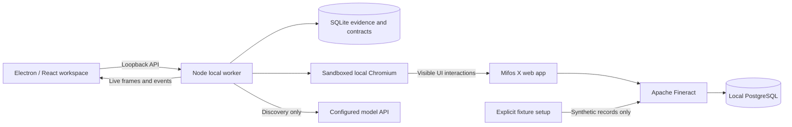

# Local implementation decision

The default application runs entirely on the user's laptop: Electron/React, a Node worker, sandboxed Chromium, and the Mifos X web app backed by Apache Fineract and PostgreSQL. Docker Desktop runs the target services locally; it does not rent or provision a cloud desktop. No AWS account is required. Model discovery still calls the configured external model API; deterministic replay needs no model service.

The separate Local Credit Union Lab is an explicit `--lab` option for repeatable failure injection. It does not stand in for Mifos qualification. The same worker selects a registered target adapter; each adapter owns UI login, stable visible selectors, checkpoints, network policy, and reconciliation. Capabilities and run history are scoped to the selected target.

Mifos also supports a separate `member` operation. Ambiguous account goals ask whether a new customer is needed; new-customer goals collect first/last name and an unused external reference. The worker checks that reference through the member-search UI, prepares the actual client preview, binds approval to the complete visible summary, and permits only the exact reviewed `POST /clients` body. Office identity comes from the verified local fixture manifest. The activation date is resolved anew from the visible Submitted On input for each run. Generated Mifos member account numbers are kept distinct from external references. Recovery searches and verifies the existing member through the UI without repeating creation; a later savings operation is separately reviewed.

`npm run setup` checks the laptop, preserves `.env`, starts digest-pinned images, waits for authenticated service readiness, and seeds two fictional members and USD products. Seed writes use a durable journal so a retry preserves existing records and does not fund an account twice. Browser runs never import the seeder or use backend responses to decide business results. They authenticate through Mifos's UI and verify visible member, account, product, currency, preview, and pending-application state.

The only published port for the banking stack is the Mifos UI and same-origin API proxy on `127.0.0.1:4200`. Fineract and PostgreSQL are reachable inside its Compose network. Image digests, source tags, architecture constraints, and the upstream snapshot version label are recorded under `infra/mifos/`.

## Implemented boundaries

- **Desktop:** Electron sandbox, context isolation, no Node integration in the renderer, blocked external navigation and permission requests. React can call the local API; it cannot directly drive the target browser or read provider credentials.
- **Worker:** serializes browser input and enforces ownership epochs. Takeover/pause/stop revoke future dispatch, drain current input, then acknowledge. Newer control requests supersede older ones. Manual input carries an exact frame revision and command identifier.
- **Browser:** one headless Chrome browser instance with its sandbox enabled, a context per session, blocked downloads/service workers, and requests restricted to the configured loopback target. The live image is captured from that same browser; human input acts on its page. This is an actual Chrome worker, not a desktop VM or a recreated application UI.
- **Contracts:** Zod schemas for tasks, typed parameters, recorded steps, capabilities and manual commands. Authored and discovered provenance are separate. Discovery selects observed controls and parameter references. Replay interprets the stored contract without a model.
- **Page transitions:** Mifos actions wait for the expected visible destination before the next observation. A completed click or document load alone does not prove that Angular has rendered the member, account, or wizard panel. The worker checks control ownership again after this wait. Balance completion requires the account detail view; application previews must include the requested product and external reference even when Mifos marks that field optional.
- **Discovery limits:** the worker caps model requests, dispatched browser actions and active execution time, and detects repeated waits or unchanged observations. Pause, takeover, stop and shutdown abort provider transport; ownership and epoch are checked again before dispatch. Human review time is excluded, and Resume cannot replenish a spent total budget. A pending approved submission reuses its checked proposal rather than asking the model for another instruction.
- **Capability review:** eligibility is recomputed from a source discovery and autonomous, zero-model replays of the exact artifact digest with different business inputs. Manual repair, reconciliation, same-input replay and success counters cannot qualify an artifact. Review records the digest and evidence run IDs; durable source/replay lookup works outside the latest 100 runs. These are local case results, not reliability percentages or production certification.
- **Approval:** the exact preview is checked against requested inputs, then bound to session, epoch, artifact/task and preview digest. Approval expires after five minutes. The worker consumes it once before allowing the target's submission request. Human clicks and keyboard submission cannot bypass the network gate.
- **Persistence:** SQLite WAL stores run events, inputs, results, request deduplication and capability versions/digests. Mifos persists applications in PostgreSQL independently of the workbench; the separate lab uses its own record file. A durable uncertain intent precedes the external submission request. Restart terminates lost sessions and never replays commits automatically.
- **Evidence:** semantic step events plus a latest screenshot per run. This first slice does not store a full per-action screenshot trace or video. Evidence is local synthetic data with owner-only creation permissions, not a production encrypted evidence vault.
- **Reconciliation:** an unknown outcome stays unknown until the visible application register contains one exact matching application with a reference and pending-approval status. This is read-only and can run after restart. The target's external-reference uniqueness is a lab feature, not an exactly-once guarantee for arbitrary applications.

## Local choices and their limits

| Choice | Reason | Production transition |
|---|---|---|
| Node + TypeScript across worker and desktop UI | Shared contracts, straightforward local tools | Keep contracts; separate control plane and workers |
| Built-in SQLite | No extra database service for workbench history | Retain for a qualified single-writer pilot with backups; use PostgreSQL when multi-process coordination or tenancy needs it |
| Electron | Working macOS desktop shell and a path to Windows | Signed builds, updates, OS-specific verification |
| Playwright over installed Chrome | Real observable browser interaction, avoids another browser download | Pinned worker/browser image and adapter qualification |
| Local Mifos X + Fineract + PostgreSQL | Independent real banking UI and persistent backend, reproducible with Compose | Expand verified workflows and application-version drift coverage |
| Explicit Local Credit Union Lab | Deterministic fault injection with a small footprint | Retain as regression harness |
| Two active sessions, bounded retained browser contexts | Keeps local resource use predictable | A queue and measured concurrency limit on shared-host browser workers |
| In-memory provider keys | Tests discovery without a secrets service | OS keychain locally; managed secret broker in cloud |

The model integration is a bounded multimodal action adapter. It is not yet a comparative benchmark of vendor-native computer-use tools. Live provider authentication must succeed before any claim of model discovery accuracy. A provider error produces an intervention; no scripted fallback invents discovery evidence.

The UI is the sole business-action interface for discovery and replay. Test code may inspect the synthetic persistence store as an independent oracle; runtime business verification reads visible target fields. Native application automation, voice, cloud deployment, SSO and production use with real customer records are outside this local build.

## What the browser session represents

`surface.ts` launches installed Chrome with `headless: true` and `chromiumSandbox: true`; `engine.ts` creates a fresh browser context for each run. Chrome's headless mode provides real browser functionality without displaying platform windows. The Electron console is the operator interface, while screenshots and input refer to the worker browser. [Chrome headless mode](https://developer.chrome.com/docs/automation-and-testing/headless), [Playwright launch options](https://playwright.dev/docs/api/class-browsertype#browser-type-launch-option-chromium-sandbox).

Playwright contexts separate cookies, local storage and session state. They share the browser's lifetime and host resources. Our design therefore does not treat a context as an OS security boundary between untrusted tenants; browser failure can also affect multiple contexts. The current allowance is one local operator working against synthetic fixtures. [Playwright context isolation](https://playwright.dev/docs/browser-contexts).

## Optional future hosting (not required to build or test)

For one trusted tenant, the proposed next topology is an authenticated TLS gateway/control service and supervised browser workers on a single Linux host. Prefer a separate browser process per active worker to contain ordinary browser crashes; a container can additionally constrain its filesystem and resources. Use fresh per-run state and destroy it at session expiry. Start with a two-session admission limit and a queue. Keep worker lifetime independent of gateway restarts and preserve existing ownership, approval and unknown-effect contracts. These hosted components are planned, not implemented or provisioned here.

Qualify a pinned browser/runtime image as non-root with Chromium sandboxing enabled, compatible namespace/seccomp support, sufficient private shared memory and CPU/memory limits. The Playwright Docker guide documents container execution but labels its stock image for testing/development; root disables its Chromium sandbox. Its host-IPC and development privilege examples are not this project's deployment policy. Use private IPC and investigate compatibility failures rather than adding `--no-sandbox`, privileged mode or unrestricted host access. [Playwright Docker guidance](https://playwright.dev/docs/docker), [Chromium Linux sandbox](https://chromium.googlesource.com/chromium/src/+/main/sandbox/linux/README.md).

The pilot qualification must verify sandbox activation, concurrent memory/CPU behavior, a browser crash during takeover, cleanup after restart, network restrictions, inaccessible debugging endpoints and exact-session input fencing. Apply host/network egress controls in addition to Playwright routing. Containers need explicit resource limits and a restricted configuration; default containers alone are not the claimed boundary for untrusted tenants. Keep Docker control sockets and host credentials out of browser workers. [Docker resource limits](https://docs.docker.com/engine/containers/resource_constraints/), [Docker security](https://docs.docker.com/engine/security/).

Before untrusted tenant rollout, qualify stronger container/runtime isolation, microVMs or a managed browser service against that threat model. This is a separate gate; lowering pilot infrastructure cost does not waive it or disable the browser sandbox. The shared-host pilot accepts a common host failure domain and does not imply production high availability.

Browser-only execution still consumes compute, storage and bandwidth. [Delivery and cost](../plans/delivery-and-cost.md) gives the revised formula and marks the old $500–550/month topology as historical. US business requirements do not automatically select a US hosting region or authorize real customer data; region, access and data permissions remain explicit onboarding decisions. The current local target uses synthetic data.
