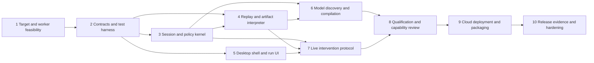

# Implementation blueprint

Status: construction plan with a working local browser slice, 23 September 2026. Local runtime and test evidence exist; no cloud infrastructure has been provisioned. Read [local architecture](../docs/local-architecture.md) for implemented boundaries and [system-design.md](system-design.md) for the remaining product design.

The workspace contains the assignment, plans, Electron/React interface, TypeScript browser runtime and tests. There is no Git repository yet. Continue local development under the current browser-first scope. The assignment's eventual public publication/email steps are not authorization to perform them now.

## Working agreement

Build a macOS operator app, a deployable cloud execution service and the isolated Mifos X web app (backed by Apache Fineract) as the target. Keep shared types and the deterministic interpreter independent of Electron, the model provider and AWS. A new contributor must be able to run the target and core tests locally without cloud credentials; live discovery additionally requires a model credential. See [delivery-and-cost.md](delivery-and-cost.md) for effort allowances, illustrative milestone dates and operating-cost assumptions.

Proposed repository layout:

```text
apps/desktop/                 Electron + React operator client
apps/control-plane/           authenticated API, gateway, dispatcher
apps/session-worker/          ownership, policy and surface execution
packages/contracts/           JSON Schemas and generated TS types
packages/capabilities/         bounded interpreter and artifact compiler
packages/surfaces/             web adapter and future native contracts
packages/policy/               action authorization and revocation
packages/evidence/             sanitization and structured events
profiles/mifos/                reviewed target bindings and detectors
infra/                        local target + AWS deployment definitions
tests/fixtures/               synthetic data and hostile surface fixtures
evidence/                     real, sanitized execution evidence only
README.md                     verified setup/discovery/replay commands
REPORT.md                     concise assignment write-up after implementation
```

The commands below are proposed project scripts to create during implementation, not commands that already work. Establish `pnpm lint`, `pnpm typecheck` and `pnpm test` in step 2. Subsequent steps introduce their named verification scripts.

## Dependency map



Steps 3, early portions of 4, and 5 can proceed in parallel after contracts stabilize. Step 4 integration waits for the real session kernel. Keep file ownership disjoint until shared protocol changes are reviewed. Steps 6 and 7 can proceed in parallel after their dependencies. Use the strongest available reasoning for contracts, policy, effects and ownership review; ordinary implementation can use the project's default coding agent. Do not introduce model-specific application dependencies based on this staffing preference.

## 1. Prove target semantics and a cloud-compatible session

**Context:** The Mifos X web app is the real proxy target; Apache Fineract is its backend. Documentation supports a Preview screen but does not prove pinned runtime behavior. Cloud sessions must support real manual input and safe browser configuration.

**Work:** Pin compatible target versions and licenses/notices; provision synthetic client, account and product fixtures; inspect read-balance, prepare and submit flows. Verify no persistence before Submit. Build on the implemented local Chrome worker, then qualify a pinned Linux browser process/container with non-root sandbox and sufficient private shared memory for the proposed shared-host pilot. Prove screenshot-to-input coordinate mapping, dialogs, page navigation, keyboard input and a live same-session manual interaction. Evaluate managed browser hosting only if it improves the measured tradeoffs without changing the control contract; a dedicated VM per run is not the default.

**Verify:** Create `pnpm target:up`, `pnpm target:seed` and `pnpm verify:feasibility`. Inspect UI outputs and separate test-harness truth. Save sanitized feasibility notes, exact versions and resource measurements. Network inspection may validate the UI-only boundary in tests; agent observations must not use response payloads.

**Exit:** Target starts reproducibly; Preview/Submit effects are understood; browser sandbox and basic live input work; unresolved issues have an explicit target/hosting decision.

**Rollback:** Change target/profile or worker provider before product coupling. Do not weaken sandbox or approval semantics to pass the spike.

## 2. Define contracts, state and a conformance harness

**Context:** The artifact, invocation, session and effect contracts are the central seams. No component may infer authority from UI appearance.

**Work:** Define JSON Schemas and generated TS types for artifacts, execution manifests, invocation/results, action receipts, session generations/epochs, approvals, interventions and sanitized evidence. Define the predicate DSL and bounded control-flow rules. Add Postgres migrations for tenant-scoped registry, runs, session control, action intent and provisioning outbox. Provide a local database and deterministic fake surface for interpreter tests.

**Verify:** `pnpm lint && pnpm typecheck && pnpm test:contracts`. Reject unknown schema versions, unbounded loops, missing success predicates, raw secret literals, invalid transitions and unsafe overlay changes. Confirm migration up/down strategy on disposable data.

**Exit:** Contract fixtures cover success, business outcome, intervention, partial effect and unknown mutation. The fake surface is explicitly labeled; it is not discovery evidence.

**Rollback:** Evolve unshipped schemas together; once published, use explicit migrations/new versions rather than silently changing meaning.

## 3. Build the session worker and policy kernel

**Context:** One worker owns one live browser and is the final input authority. Automation and human input must share that authority.

**Work:** Implement the web adapter; application-origin/frame/popup checks; target resolution; bounded actions; local action lease watchdog; session generation and control epoch validation; scoped credential handles; parameter provenance; sanitized events. Separate readable live observation from persisted evidence. Build heartbeat/registration against expected session identity, and idempotent command acknowledgement.

**Verify:** `pnpm test:worker`. Reject wrong tenant, actor, epoch and viewport; block unauthorized navigation and actions; verify popup/redirect/service-worker behavior; prove a waiting action cannot fire after quiescence acknowledgement. Check credentials and seeded canary data never reach logs.

**Exit:** Browser inputs pass one gate, ownership changes require acknowledgement, and known effect classes are enforced by application profile.

**Rollback:** Disable the worker image/profile and stop accepting new runs; preserve sanitized incident evidence and reconcile any active mutation.

## 4. Implement model-free replay and result verification

**Context:** Replay consumes only approved immutable artifacts, typed inputs and application observations. There is no model fallback.

**Work:** Implement the bounded interpreter, ordered target strategies, predicates, extraction, fixed exception detectors, retry budgets, action-intent journaling and terminal result contract. Build real Mifos read/prepare flows as development fixtures before discovery generates equivalent candidates. Label authored fixtures honestly.

**Verify:** `pnpm test:replay`. Different client/account inputs; zero/ambiguous matches; validation rejection; denied permissions; expired session; slow reads; unexpected dialogs; application mismatch. Deny model egress and remove model credentials. Inject accepted Submit with dropped response and require reconciliation without repeat submission.

**Exit:** Deterministic control decisions and verified output contract; no unexplained broad locator fallback; no automatic retry of unknown mutation.

**Rollback:** Quarantine a capability digest; route new invocations to a previous compatible version. Never change the version underneath active runs.

## 5. Build the macOS operator experience

**Context:** The user sketches define a corporate welcome view and three-column workspace. The cloud runs the application; the client displays and controls it.

**Work:** Electron security configuration, system-browser OIDC/PKCE, tenant selection, Overview, Run Workspace, catalog, intervention inbox and history. Render status from server events with reconnect cursors. Implement live-frame freshness, focus mode, action acknowledgements and tenant/environment/control labels. Add an open goal composer. Add push-to-talk only when it produces a reviewable transcript; no voice approval shortcut.

**Verify:** `pnpm test:desktop` and a keyboard/screen-reader walkthrough. Use clearly labeled simulated events only for UI development. Verify stale frames disable control; reconnect does not create a new invocation; switching tenants cannot retarget an active run.

**Exit:** All important lifecycle states have readable views; no fake success states, percent-complete estimate or ambiguous generic approval button.

**Rollback:** Ship a previous signed client only if its protocol remains compatible; server capability negotiation must reject incompatible clients safely.

## 6. Add genuine LLM discovery and artifact compilation

**Context:** Discovery is the only model-driven execution path. A successful trace creates a draft, not an approved production capability.

**Work:** Build provider adapters and begin the 72-trial Anthropic/OpenAI/Google comparison specified in system-design.md using cases supported by the completed runtime. Finish approval/handoff-dependent cases in stage 8 after the real stage 7 mechanism exists; simulated behavior cannot count as qualification evidence. Add held-out replays of compiled artifacts. Do not preselect a production provider. Implement a typed proposal loop, one bounded action at a time, observation sanitization, action budgets, stuck detection and explicit completion verification. Capture input provenance and reviewed target candidates. Compile into the same schema used by replay. Attach only declared/tested exception handling. Record model/prompt/adapter/compiler identities without raw sensitive transcripts.

**Verify:** `pnpm discover -- --goal <goal> --app <installation>` then `pnpm replay -- --artifact <path> --inputs <fixture>`. These scripts must operate a real UI and produce genuine evidence. Repeat with different inputs, inspect binding correctness and run with provider blocked on replay.

**Exit:** At least one authentic successful discovery compiles to a schema-valid draft and replays with new parameters. Provisional provider comparison records completed gates, verified outcomes, reusable-capability yield, latency and actual cost. Handoff-dependent qualification waits for stages 7 and 8. An unsuccessful model run is reported as such; a provisional candidate is not an approved production provider.

**Rollback:** Disable discovery/provider without disabling approved deterministic replay. Retain the previous approved artifact; discard or quarantine the failed candidate.

## 7. Complete live intervention and approval

**Context:** Four separate flows exist: clarification, approval, takeover and administrative policy change. The same browser must survive ordinary takeover.

**Work:** Exclusive intervention claims, pausing/quiescence acknowledgement, human lease, prioritized input channel, state-bound approval grants, handback verification and operator action summaries. Expired leases remain paused. Implement wrong-record detection, manual-completion attestation and proposed artifact revisions. Emergency revocations override pinned permissions.

**Verify:** `pnpm test:handoff`. Two operators race; takeover arrives during a waiting click; old commands arrive late; a gateway restarts; operator connection fails; approved preview changes; human navigates to the wrong client; browser dies. Race two submits against one prepared context and approval; exactly one reaches dispatch. Test unauthorized human submission through both button and keyboard paths. Verify session identity is preserved where promised and explicitly lost where not.

**Exit:** A real operator repairs a real live session and automation resumes from a verified checkpoint. No concurrent input owners and no stale approval execution.

**Rollback:** Disable handoff issuance and pause affected sessions. A failed handoff never automatically gives control back to automation.

## 8. Qualify capability review, reuse and tenant boundaries

**Context:** A reviewed digest plus application profile and tenant binding defines an executable capability. Reliability belongs to a specific tested configuration.

**Work:** Draft/review/approve/quarantine registry; readable version diff; typed catalog/invocation endpoints; validated tenant specialization; compatibility probes; an intentionally poor-DOM fixture. Validate encrypted expiring business-state references, redaction and evidence export. Implement tenant authorization and row-level/storage/stream checks. Complete provider handoff and data-handling gates using the stage 7 mechanism, then select the initial provider only if its configuration passes.

**Verify:** `pnpm test:qualification`. At least 30 read/prepare replays across representative states; a second safe profile specialization; incompatible version rejection; adversarial page instruction ignored; cross-tenant access tests; canary data scans. Report denominators and failures, not an invented confidence score.

**Exit:** Required contract and privacy checks pass; observed reliability and limits are documented. No claim that the sample proves production reliability at scale.

**Rollback:** Quarantine only affected bindings/digests, retaining prior evidence and audit history.

## 9. Deploy the cloud pilot and package macOS

**Context:** Cloud execution is a user requirement. The operator client is not the runtime supervisor. Use one region and bounded concurrency initially.

**Work:** Follow the revised browser-first hosting decision in [local architecture](../docs/local-architecture.md): one Linux host for a trusted-tenant synthetic pilot, authenticated TLS ingress, modular control service and supervised sandboxed browser processes or qualified containers. Queue sessions behind a measured concurrency cap; per-session VMs and a managed database are not automatic requirements. Add private evidence storage, secrets, scoped network bindings, transactional provisioning outbox, allocation idempotency, orphan cleanup, worker-state reconciliation and independent worker lifetime. These control guarantees apply to process/container allocation as well as any future VM backend. Sign/notarize macOS distribution and verify update/protocol compatibility. Define credential and DNS configuration without committing secrets. Use the revised [cost formula](delivery-and-cost.md), not the historical AWS budget as a minimum.

**Verify:** `pnpm verify:deployment`. Repeat provisioning delivery; crash after successful allocation before persisting its response; delay worker-state reads; restart API/gateway; expire credentials; partition worker during revocation; restore database backup; enforce cleanup/retention and destruction of expired browser state and allocated workers; verify workers have no public debugging ports. Prove only one session generation can receive credentials and input authority. Verify the enabled Chromium sandbox, private shared memory, resource limits, concurrent load and browser crash behavior. Measure startup, memory, latency and streamed bytes. Use synthetic data only during qualification. Untrusted tenant rollout additionally requires a qualified stronger isolation boundary; browser contexts alone do not pass that gate.

**Exit:** A cloud-hosted run survives client and gateway reconnect; worker death is surfaced without unsafe replay; scoped identity and tenant boundary tests pass; deploy/rollback procedures are rehearsed.

**Rollback:** Drain API connections and reconnect viewers; keep compatible live workers running. Rollback does not recreate sessions. Stop a faulty worker version only with affected runs marked and effects reconciled.

## 10. Produce honest evidence and the release report

**Context:** The assignment expects actual discovery and replay evidence plus a concise report. This plan alone cannot satisfy those implementation requirements.

**Work:** Produce saved artifact, discovery log, replay log, failure/outcome run, real intervention evidence and optional short recording, sanitized before export. Write exact tested README commands. Create `REPORT.md` using the seven required headings: Architecture; Artifact schema; Determinism & error handling; Heterogeneity & multi-tenant; Escalation & handoff; Safety; Cuts. Link deeper design docs instead of exceeding the concise report scope.

**Verify:** `pnpm verify:release`. A fresh environment follows the README successfully. Review source/evidence for credentials and sensitive data. Confirm all claimed features exist, every stub is labeled and test results come from real runs. Review unresolved risks before expanding beyond the pilot.

**Exit:** A reproducible end-to-end system and a truthful evidence package are ready for review. Public publication or submission follows a later explicit instruction.

**Rollback:** Retract an incorrect release artifact/version and correct the report; never rewrite historical evidence to conceal failure.

## Plan maintenance

Preserve the acceptance criteria when splitting or reordering work. Record a short dated decision when changing the target, browser provider, artifact contract or safety model. Re-run only the affected qualification gates plus essential cross-cutting ownership/tenant/effect tests. Every implementation milestone must report implemented behavior, verification evidence and remaining limitations separately.
