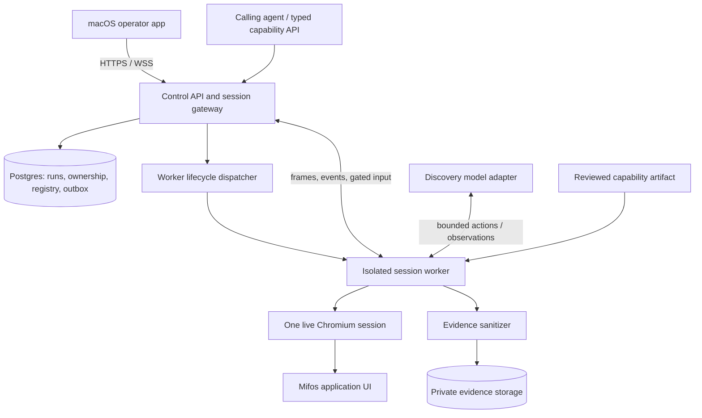
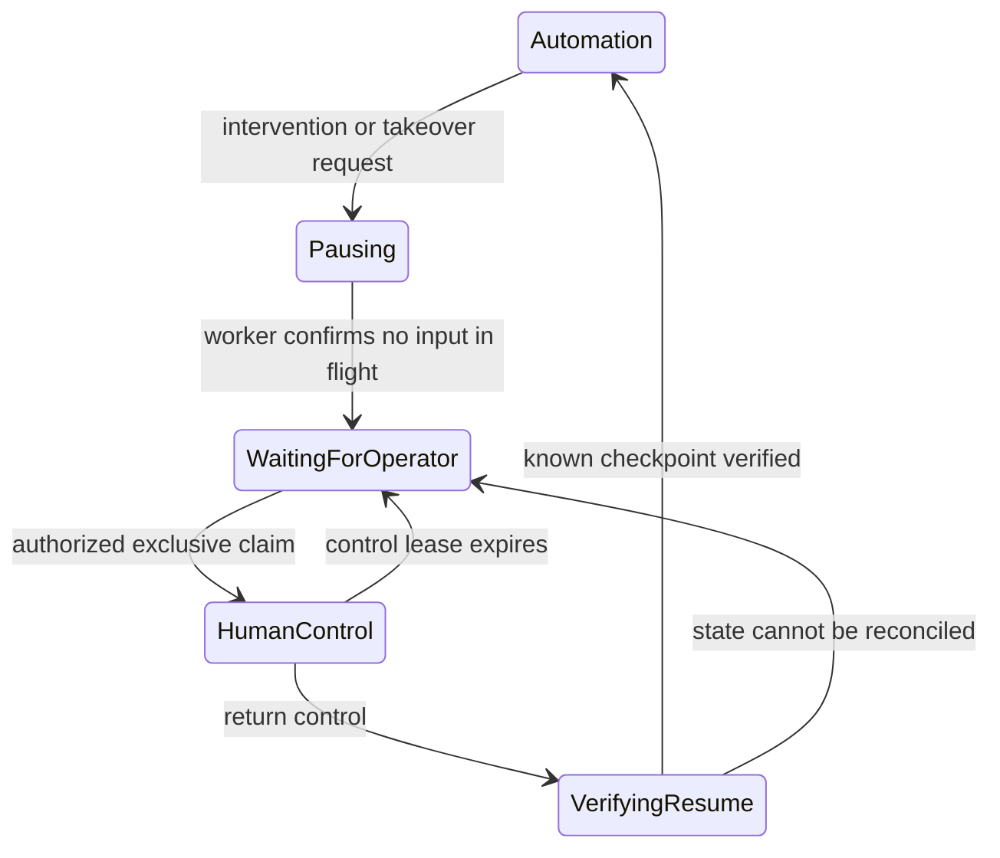

# Computer-use automation: product and system design

Status: product design with an implemented local browser slice, 23 September 2026. See [local architecture](../docs/local-architecture.md) for implemented boundaries; cloud execution and broader production guarantees remain proposed and unmeasured.

The product should turn a natural-language request into a verified operation inside an application, and turn a successful discovery into a reviewed capability that can run without a model. Its most valuable properties are clear contracts, correct handling of exceptional states, and accountable control of business effects.

The user confirmed macOS first, Windows next, laptop execution now and possible hosted browser sessions later. The desktop controls a local worker today; a future hosted worker may run on a shared Linux host under the revised browser-first decision below. Supporting a Windows desktop client later is separate from automating a native Windows application.

## 1. Inputs and scope

The source is [Assignment A — Computer-Use Automation System.pdf](../Assignment%20A%20%E2%80%94%20Computer-Use%20Automation%20System.pdf). It defines seven core areas: live model-driven discovery; typed reusable artifacts; deterministic replay and outcomes; safety; evidence; live human handoff; and credible heterogeneous/multi-tenant design. The two sketches add a corporate welcome screen, Google sign-in, a desktop workspace with a live application view, chat and voice input, a step timeline, dashboard statistics, and support for novel goals beyond a fixed menu.

The PDF permits a deliberately small implementation and mocked presentation. The user's request calls for a serious product. Reconcile these by building a complete, deployable first slice with strong execution boundaries, then expanding supported applications and capacity. A designed extension is not a claim that native desktop automation or hundreds of tenants have been validated.

The PDF's eventual public-repository and submission instructions are deliverable requirements to track. They are not instructions to publish or email anything during this design exercise.

## 2. The target application

**Choose the self-hosted, version-pinned Mifos X web app (backed by Apache Fineract), with synthetic clients and accounts.** This is one UI automation target; Fineract provides its backend platform. It supplies meaningful banking workflows without obtaining access to a bank's systems.

| Candidate | Value | Tradeoff | Decision |
|---|---|---|---|
| Mifos X web app (backed by Apache Fineract) | Real client, savings, form, permission and approval workflows | More setup; modern web UI does not prove legacy/native support | Primary target |
| ERPNext | Real business forms and document lifecycle | Less relevant banking domain; substantial ERP scope | Reserve alternative |
| Purpose-built legacy fixture | Repeatable faults, frames, tables, poor semantics | Testing only a surface we invented can conceal weakness | Small conformance fixture |

Mifos's shared public demo resets periodically; it is unsuitable for reproducible evidence. Its README and current Compose file also differ about whether the backend is included. Provision an explicit compatible frontend/backend/database combination and verify it on a clean machine before promising an installation command. The upstream test deployment is a synthetic target environment, not a production banking deployment. [Mifos README](https://github.com/openMF/web-app/blob/dev/README.md), [Compose file](https://github.com/openMF/web-app/blob/dev/docker-compose.yml), [Fineract deployment guidance](https://github.com/apache/fineract#how-to-run-using-docker-or-podman).

The target has APIs, but our automation must use only its UI. The browser's ordinary requests to its backend are necessary; the agent must not call those APIs directly, read their response bodies, inspect framework stores, or query its database. Seeding and failure injection belong to a separate test harness whose privileges are unavailable to the agent.

### First three capabilities

1. **Read a savings balance.** Search for an exact synthetic client reference, verify identity, select an exact account, verify account identity, extract the displayed current balance, currency and status. Return an observation timestamp. Do not rename current balance as available balance: they are distinct concepts. IDs remain strings; money uses decimal strings and currency.
2. **Prepare a savings application.** Find the client, choose the product, fill Details/Terms/Charges and stop at Preview. Verify the preview values. Return a prepared summary and an opaque, short-lived prepared-context reference.
3. **Submit the reviewed application.** Validate the prepared context and approval, click Submit once, then independently verify the created record and status. The application's own subsequent approval/activation is a separate business process.

The source contains a Preview step before submission. Submission creates a persisted application even if it is still Pending Approval. The pinned build must be tested to confirm the earlier steps have no persistent side effects. [Creation UI](https://github.com/openMF/web-app/blob/dev/src/app/savings/create-savings-account/create-savings-account.component.html), [submit implementation](https://github.com/openMF/web-app/blob/dev/src/app/savings/create-savings-account/create-savings-account.component.ts), [Mifos workflow](https://docs.mifos.org/mifosx/user-manual/for-operational-users-mifos-x-web-app/accounts-and-transactions/deposit-accounts/mifos-x-saving-accounts/how-to-create-a-saving-account-application).

Preparation can be a complete read/form-fill capability. Keeping its live form for a later submission is an explicit leased resource, with expiry shown to the user. If the browser is lost or the form changes, the prepared-context reference becomes invalid. It is not a reusable promise to submit on a new session. A combined prepare-and-submit operation remains awaiting approval until a person decides.

A prepared context transitions transactionally from available to claimed-for-run, then consumed or invalidated. Only one submission can claim it, even when callers use different request keys. Bind it to the browser generation and verified preview digest. Lost submission acknowledgement never makes the context reusable.

### More use cases without a restrictive category menu

The goal composer accepts open language. The system can later support statement retrieval, servicing status checks, contact-change preparation, reconciliation, maintenance requests and cross-application work. A catalog is an inventory of known capabilities, not the boundary of possible user intent. New work still requires a precise success condition and an authorized scope. An unrecognized goal must not silently expand permissions.

Cross-application workflows compose verified capability results and checkpoints. They do not create an atomic transaction across independent UIs. If a later operation fails, report partial completion and use only separately reviewed compensating actions.

## 3. Product experience

Preserve the sketches' three-part workspace: navigation on the left, live application and composer in the center, verified progress and intervention details on the right. Add a capability catalog, intervention inbox, application connections and run history. The detailed UX contract is in [desktop-experience.md](desktop-experience.md).

The top strip must always identify the institution, application, environment, run mode and control owner. A timestamp distinguishes a live frame from a stale image. Show meaningful steps such as “Account identity verified”; a successful click alone does not deserve a completed checkmark.

Keep the welcome screen's corporate image and Google sign-in. For deployment, use an OIDC identity boundary; Amazon Cognito is a reasonable AWS default with Google and enterprise identity federation. Desktop authentication opens the system browser with authorization code + PKCE. Product login and target-app login remain separate. Tenant membership and role come from server-side authorization, not an email domain alone. [Cognito federation](https://docs.aws.amazon.com/cognito/latest/developerguide/cognito-user-pools-identity-federation.html), [native-app OAuth](https://developers.google.com/identity/protocols/oauth2/native-app).

Voice is push-to-talk, producing an editable transcript. It does not authorize a mutation merely because someone said “yes.” Risky actions use an explicit action-specific approval card.

## 4. Recommended implementation choices

| Concern | Choice | Reason and cost |
|---|---|---|
| Desktop | Electron, React, TypeScript, Vite | Good fit for a rich operator client and shared protocol types; carries a larger runtime than a system-webview shell |
| Service | TypeScript, Node.js, Fastify; modular application | One language across contracts, worker and UI; explicit modules without a microservice fleet |
| Contracts | JSON Schema, runtime validation, generated TypeScript types | Artifacts and agent calls remain portable and independently inspectable |
| State | PostgreSQL | Durable cloud jobs, ownership transactions, reviews and tenant boundaries |
| Browser adapter | Playwright + Chromium | Real UI interaction, frame support, semantic targeting and explicit assertions |
| Discovery | Provider adapter; evaluate Anthropic, OpenAI and Google computer-use offerings | Choose from measured discovery and subsequent replay results; no provider winner is assumed |
| Evidence | Sanitized structured events + sanitized object storage | Debuggability without persisting raw credentials or personal data |
| Deployment | AWS control service, isolated browser workers, RDS, S3, KMS, Secrets Manager | Explicit ownership of session lifetime, network access, identity and data |
| Orchestration | Durable run state machine, Postgres job/outbox tables | Fits the first release; add a broker/workflow service only for demonstrated operational needs |

Electron must use sandboxed renderers, context isolation, no Node integration in the renderer, a narrow IPC bridge and signed updates. The target site is never loaded into a privileged renderer. Tauri is a credible smaller-shell alternative, but introduces Rust/sidecar packaging while the automation still needs its own controlled browser runtime. This is an engineering fit decision, not a claim that one shell is universally safer. [Electron security](https://www.electronjs.org/docs/latest/tutorial/security), [Tauri process model](https://v2.tauri.app/concept/process-model/).

The provider proposes only typed actions through our tool interface. Do not grant generated code, shell, unrestricted HTTP or filesystem access. Start with one planner, not a group of autonomous agents issuing concurrent UI commands. Record model identifiers and response metadata; use a dated snapshot if the provider offers one, otherwise record the alias and acknowledge its reproducibility limit. Provider-native computer actions are translated into our internal action contract and checked individually before dispatch. The narrower interface is deliberate and may change performance relative to vendor demonstrations.

### Discovery-provider qualification

Evaluate one currently supported computer-use model from each of three providers. Selection is open; familiarity with one SDK is not evidence of better task performance.

| Candidate | Why include it | Qualification concern |
|---|---|---|
| Anthropic Claude computer-use tooling | Dedicated computer-use tool protocol executed by our environment | Model/tool-version and hosting-platform compatibility; preserve required tool bookkeeping |
| OpenAI Responses computer-use tooling | Structured computer actions compatible with an application-owned executor | Compare the structured route under our restrictions; unrestricted code execution is a different experiment |
| Google Gemini Computer Use | A third documented computer-use implementation to compare | Current documentation labels Computer Use Preview; a stable model does not make every attached capability generally available |

These descriptions come from current primary documentation checked on 23 September 2026, not an independent performance ranking. Recheck model IDs, API maturity, account access and deployment terms when the evaluation begins. [Anthropic computer use](https://platform.claude.com/docs/en/agents-and-tools/tool-use/computer-use-tool), [OpenAI computer use](https://developers.openai.com/api/docs/guides/tools-computer-use), [Google Computer Use](https://ai.google.dev/gemini-api/docs/computer-use).

Use the same target build, synthetic fixtures, viewport, action budgets, policy and independent verifier. Normalize provider-native actions, call IDs, safety signals and screenshot coordinates without weakening enforcement; check every proposed action in a batch separately. Allow provider-specific protocol instructions while keeping task information and execution privileges equivalent.

The initial comparison is eight cases per provider, repeated three times: lookup, prepare, approved submission, not-found, validation rejection, transient delay/dialog, permission/session interruption, and an adversarial instruction displayed by the app. That is 72 discovery/probe runs, with reset fixtures and randomized provider order. Each successfully compiled capability also receives three held-out deterministic replays with model access disabled. This comparison precedes, and does not replace, the broader release qualification matrix.

Hard gates are verified outcomes, no executed forbidden actions, replayable typed artifacts, correct same-session handoff and acceptable data handling. Any failure blocks qualification until corrected. Record attempted forbidden actions separately: a policy layer blocking a bad proposal does not establish model adherence. Stage 6 produces provisional comparison results; complete handoff testing after stage 7 and make the qualification decision in stage 8. Select among passing configurations by verified task completion and reusable-capability yield, then end-to-end latency and total cost per reusable capability. Include retries, worker time and human intervention; token price alone is insufficient. A small comparison selects an initial provider, not proof of production reliability.

## 5. Cloud sessions and deployment



There are two independent products in this diagram: the application being operated and our automation service. The Mifos X web app and its Fineract backend are separately deployed and resettable; neither is a module inside the executor.

**Revised browser-first foundation:** run real sandboxed Chrome on the laptop now; no VM or cloud infrastructure is required for the local implementation. For an eventual single trusted-tenant, synthetic-data pilot, share one Linux host across the control service and supervised browser worker processes or qualified containers, with a queue and measured concurrency limit. Start at two active sessions until load tests justify more. A host may be rented as a VM, but a separate VM per session is no longer the default. Use fresh per-run browser state, destroy expired state, and keep worker lifetime independent of gateway deployments. See the current [local architecture](../docs/local-architecture.md) and [cost model](delivery-and-cost.md); these supersede the earlier Fargate/RDS/per-session-EC2 baseline and $500–550 default budget.

Qualify the Linux browser runtime with its sandbox enabled, non-root execution, adequate private shared memory, restricted egress and explicit resource limits. Playwright's stock Docker image is a testing/development reference, not proof of production isolation. Do not fix startup by disabling the sandbox or granting unrestricted host privileges. Browser contexts separate session state; they do not establish our untrusted-tenant security boundary. This shared-host pilot accepts a common host failure domain and does not authorize untrusted tenant co-location. [Playwright container guidance](https://playwright.dev/docs/docker), [Chromium Linux sandbox](https://chromium.googlesource.com/chromium/src/+/main/sandbox/linux/README.md), [Docker security](https://docs.docker.com/engine/security/).

**Managed alternative:** Amazon Bedrock AgentCore Browser supplies isolated sessions, Playwright integration and live interaction, with documented session limits. Evaluate it behind the same session-provider interface if its region, networking, privacy and control-gateway behavior pass qualification. Raw managed recording must remain off; our sanitized evidence policy applies. It changes browser hosting, not the artifact, policy or replay engine. [AgentCore Browser](https://docs.aws.amazon.com/bedrock-agentcore/latest/devguide/browser-tool.html), [recording](https://docs.aws.amazon.com/bedrock-agentcore/latest/devguide/browser-session-recording.html).

**Stronger isolation when the threat model requires it:** before untrusted tenant rollout, qualify a hardened container/runtime boundary, microVMs or managed browser isolation. Firecracker is a KVM-based virtual-machine monitor; Kata integrates lightweight VMs with container workflows. gVisor provides a sandbox application kernel, not a microVM. These are candidates for that gate, not required infrastructure or an assumed cost-saving upgrade for the trusted-tenant pilot. [Firecracker](https://firecracker-microvm.github.io/), [Kata architecture](https://katacontainers.io/), [Kata hardware requirements](https://katacontainers.io/software/), [gVisor architecture](https://gvisor.dev/docs/architecture_guide/intro/).

Select a stronger runtime only after Chromium compatibility, isolation, state destruction, takeover latency and uncertain-effect tests pass. Compare total cost per verified result at measured utilization, including idle capacity and operations effort. Browser execution still requires compute; no savings percentage or new dollar minimum is assumed. US business context does not select a hosting region or authorize real customer data.

### One invocation from start to finish

1. The desktop or calling agent authenticates and supplies capability/version, typed arguments and a request idempotency key. The service derives tenant authority from identity and membership.
2. One database transaction records the run and provisioning outbox entry. Repeated requests with the same tenant/key return the existing run; a different argument digest is rejected.
3. A dispatcher allocates a worker in the correct tenant/network pool. Worker registration includes a one-use bootstrap credential and a run/session identity.
4. The worker opens a fresh browser, obtains only that application's credentials through scoped secret access, and verifies application and user context.
5. Discovery or replay executes through the same policy and ownership gate. The operator receives progress and a live image stream.
6. An intervention pauses that same worker and preserves the same browser. Claiming control does not create a new login or browser context.
7. Completion verifies outputs, returns permitted business data to the authorized caller, stores sanitized evidence and releases the session. A separately leased prepared session is retained only until its explicit expiry.

Persist a distinct allocation-attempt ID and provider idempotency token before infrastructure calls. A unique active session generation and transactional worker-registration claim prevent duplicate provisioned workers from becoming duplicate executors. A worker receives no target credentials until its registration and execution lease are accepted. Reconcile uncertain allocation responses, cloud state events and orphan instances; outbox delivery alone does not make provisioning exactly once. Do not hold a database transaction open while launching a worker or waiting for a person. Separate scheduler claims, worker execution leases and human control leases. [ECS task-launch idempotency](https://docs.aws.amazon.com/AmazonECS/latest/developerguide/ECS_Idempotency.html).

The desktop is a viewer/controller. It may disconnect without killing an already authorized unattended replay. Discovery pauses on loss of required supervision; human control always loses its lease and pauses on disconnect. No unanswered approval advances by timeout. Reopening the app reattaches by run ID; it does not submit another run.

### Streaming and input

Use an authenticated WSS gateway with a bounded latest-frame stream. Start with screenshot frames and adaptive refresh; qualify a higher-frame-rate CDP stream or WebRTC only if measured takeover latency requires it. Keep control messages independent of frame queues so Stop is never behind stale images.

Only the server holds browser debugging credentials. Desktop users receive short-lived, session-scoped view or control tickets. Never expose CDP ports, VNC ports or durable browser URLs. Every input contains session ID, actor, control epoch, command ID and viewport revision. Coordinate mapping accounts for scaling and pixel ratio. Reject input against stale/resized views. Reconnect checks acknowledgement state; it never blindly resends a click.

For multiple gateway replicas, resolve session ID to its live worker using a shared registry; any gateway proxies privately to that worker. Sticky routing is an optimization, not the authority for control. Configure application heartbeats and load-balancer timeouts. [ALB timeout behavior](https://docs.aws.amazon.com/elasticloadbalancing/latest/application/edit-load-balancer-attributes.html).

### Private applications and native desktops

A cloud browser can reach only networks it is allowed to access. For an institution's internal application, offer either an approved private network connection to a tenant-specific cloud worker pool, or a worker deployed inside the institution with an outbound authenticated control tunnel. Private DNS, SSO, proxy rules and application licensing are qualification items. Hosting our frontend alone does not create access to an internal banking system.

Native Windows applications need Windows workers with an interactive desktop, accessibility support and a controlled capture/input channel. That is a separate adapter and deployment environment; a Linux browser container does not provide it. macOS client support does not mean macOS workers are needed for browser automation.

### Capacity and cost

Hundreds of institutions with twenty app installations each do not require thousands of permanently running browsers. Store installation configuration; allocate execution capacity to active work. Size from arrival rate × mean session duration, including time waiting for humans, plus burst headroom and per-tenant limits. Keep a fair queue and cap per-app concurrency where target systems or shared credentials require it.

Proposed initial limits, to tune with evidence: one mutating run per app/account scope; 40 discovery actions or 10 minutes; individual bounded waits; a visible 15-minute intervention/session-retention window with authorized extension and a hard session lifetime. This retention window is separate from short, frequently renewed control and action leases. Long jobs need declared bounded iteration and checkpoints. These are product defaults, not measured capacity or provider guarantees.

Monthly cost includes idle/warm compute, active worker time, database, gateway, private networking, streamed bytes, evidence retention and discovery inference. Deterministic replay removes repeated model reasoning cost; it does not make browser compute or waiting time free. Measure cost per verified capability result before making pricing claims.

An assumption-based effort estimate, illustrative milestone dates and a monthly cost worksheet are maintained in [delivery-and-cost.md](delivery-and-cost.md). The assignment specifies no deadline and does not request a cost estimate; this sizing supports the user's broader deployed-product scope.

## 6. The reusable artifact is the core asset

Store canonical JSON validated against a versioned JSON Schema. A human-readable representation may be generated. Do not execute arbitrary YAML tags or embedded code.

| Artifact field | Required meaning |
|---|---|
| Identity | Schema version, capability ID/version, immutable content digest |
| Contract | Typed inputs, typed outputs, declared business outcomes, declared effects |
| Compatibility | Vendor/application family, supported profile versions, surface requirements |
| Target references | Semantic targets with scoped, ordered locator strategies and uniqueness guards |
| Flow | Bounded states/steps, actions, preconditions, postconditions, explicit transitions |
| Recovery | Known detectors, safe retry limits, declared recovery branches and escalation rules |
| Completion | Independently verifiable success predicate and typed extraction |
| Authorization | Required permissions, risky boundaries, approval requirements |
| Provenance | Discovery run, compiler version and validation references |

Keep mutable approval/deprecation/quarantine state in the registry referencing the immutable digest. A running invocation pins an execution manifest: artifact + surface profile + tenant binding + policy version + adapter version. Emergency revocation closes the gate for new dispatches; show requested versus acknowledged revocation. An unreachable worker must stop new dispatches at its local lease deadline. An already-dispatched action may still take effect and requires reconciliation; revocation cannot undo it.

An illustrative step, not an executable artifact:

```json
{
  "id": "open-matching-account",
  "preconditions": ["client.identity == input.clientReference"],
  "action": {"type": "activate", "target": "account.row.open"},
  "targetBinding": {"accountReference": {"source": "input", "path": "accountReference"}},
  "postconditions": ["account.identity == input.accountReference"],
  "outcomes": {"no_matching_account": "ACCOUNT_NOT_FOUND"},
  "onAmbiguity": "intervene",
  "timeoutMs": 10000,
  "retry": {"maxAttempts": 1},
  "effectClass": "navigation"
}
```

The real condition syntax must be a small typed expression language: exact comparisons, presence, Boolean composition, explicitly bounded collections, and registered parsers. No `eval`, arbitrary scripts or unbounded loops. Parameter provenance is explicit: input references, previously extracted values, approved constants or secret handles. Replacing every occurrence of a sample string in a recording is unsafe.

### Discovery and compilation

Observe a screenshot and available structured UI signals; ask the model for a typed proposal; validate target, scope, effect and budgets; execute one bounded action; verify its result; repeat. The model's claim of completion is not the completion check.

A recorder captures sanitized action receipts, observation references and parameter provenance. After success, compilation normalizes targets and bindings, validates the schema and policies, attaches reviewed application exception detectors, and creates a draft. Fresh deterministic replays with different synthetic inputs demonstrate parameterization. Human review enables a version for unattended use.

A successful trace does not teach every failure branch. Those branches come from explicit application knowledge, observed failures and tested updates. Human corrections create proposed revisions, never silent mutations of an approved artifact. Failed replay does not switch secretly to an LLM; “Investigate” starts a separate discovery/revision workflow.

## 7. Deterministic targeting and surface abstraction

Determinism means fixed, reviewed execution and decision rules with no model in replay. The same inputs can legitimately return a different balance tomorrow.

Use semantic locators where available, then scoped visible text/relationships, then stable structural anchors inside a verified frame/window. For example, locate the row with the exact account reference, then the named control inside that row. Require exactly one match. Never use `.first()` to hide ambiguity.

Playwright resolves locators against the current page and supplies actionability checks, but those checks do not verify the correct business record or completed business effect. Add explicit identity checks and business postconditions. [Locators](https://playwright.dev/docs/locators), [actionability](https://playwright.dev/docs/actionability).

For poor-DOM surfaces, use accessible controls where available, otherwise versioned visual anchors and bounded image matching. Coordinates can be outputs of a resolver, never the entire reusable selector. A visual target needs a screen/window identity, anchor, search region, threshold, uniqueness margin and postcondition. Pin the image-processing implementation. Do not imply all visual interfaces can be made safe for unattended replay; insufficiently distinguishable controls require human handling.

The adapter implements `observe`, `resolve`, `act`, `evaluate`, `extract`, `quiesce` and `sessionHealth`. It advertises capabilities. A web-only selector cannot silently become a desktop click. Flow logic can be shared; each surface needs compatible bindings and conformance tests.

## 8. Outcomes, recovery and effects

Represent lifecycle, final result and effect certainty separately:

```text
lifecycle: queued | provisioning | discovering | replaying | pausing |
           awaiting_intervention | human_control | verifying_resume | completed
result: succeeded | business_outcome | failed | cancelled   (terminal only)
effect: none | verified | unknown
```

Effect metadata also states what changed and whether requested work is partial or complete. “Verified” can describe a partial effect on a failed run; it does not imply the entire task succeeded.

| Observation | Classification | Behavior |
|---|---|---|
| Schema-invalid inputs | Invalid request | Reject before allocating a browser |
| No matching client/account | Expected business outcome | Return the declared code |
| Known business validation rejection | Expected business outcome | Return sanitized field/code information |
| Known slow read or harmless interstitial | Recoverable condition | Bounded wait or approved recovery branch |
| Authentication expiry | Intervention | Reauthenticate privately, then revalidate context |
| Permission denial | Authorization failure | Stop; no alternative route to bypass it |
| Unknown dialog, ambiguous identity or unsupported UI | Intervention/failure | Freeze and explain the failed expectation |
| Timeout after Submit | Unknown effect | Read-only reconciliation, then intervention if still uncertain |
| Session death or network partition | Execution incident | Preserve evidence; do not assume a fresh session is continuation |

Persist action intent before dispatch and acknowledgement afterward. If acknowledgement is missing for a mutation, assume it may have reached the target. Inspect a receipt/history through the UI and verify identity. An external reference helps only if the target actually enforces uniqueness; it is not automatically an idempotency guarantee. Local invocation keys cannot provide exactly-once effects in an arbitrary UI.

Cancellation stops new input; it does not undo earlier effects or stop an already accepted server transaction. An unknown outcome must not display an ordinary Retry button. When the application cannot prove whether the mutation happened, the honest result is unresolved.

## 9. Human control is a protocol

Separate clarification, one-action approval, live takeover and administrative policy changes. Each has a different authority and UI.



The session worker is the final input authority. Every command carries actor, session, run, command ID and ownership epoch. Ownership changes increment the epoch. Stale automation and human commands are rejected.

On takeover, close the automation input gate, drain/cancel in-flight work, and wait for worker acknowledgement before granting human input. Abandoning a pending Promise does not cancel an already waiting click. If quiescence cannot be proven, do not show “You have control.” A database lock alone cannot stop a disconnected worker; use a short action lease and a local monotonic watchdog. Never start replacement execution until the old worker has stopped and uncertain effects have been assessed.

On handback, close human input, capture fresh state, verify the application, tenant, signed-in identity, selected record and an allowed checkpoint. Resume from the verified state, not “the next step.” If the human changed records or completed a mutation without enough evidence, reconcile or remain paused.

An approval binds a single action to tenant, run, artifact digest, action digest, relevant parameters, record identity, material preview values and expiry. Changes to those facts invalidate it. The same operator may hold different permissions in different institutions. Sensitive operations can require a second reviewer through policy.

Also bind the grant to session generation and control epoch, and atomically consume it when recording dispatch intent. Grant consumption survives a lost acknowledgement. Two competing submissions cannot consume the same grant or prepared context. Re-read the material preview immediately before dispatch; this reduces stale-state risk but does not create an atomic transaction inside the target application. Target-side validation remains necessary.

Taking control does not grant permission to perform every operation. Known risky mutations require the same action grant whether initiated by automation, a button click or a keyboard shortcut. Private authentication and navigation repair have their own scoped manual authority. Low-level UI input cannot guarantee semantic enforcement on every application: where effects cannot be reliably recognized, restrict the target account through its own permissions/maker-checker controls, or do not offer that mutating manual path. Document this boundary rather than claiming raw remote control is universally policy-safe.

Record who controlled the session, intervals, action types, affected controls and observed effects. Mask entered values. “Completed manually” is either independently verified or explicitly operator-attested; it is not silently counted as verified automation success.

## 10. Guardrails and data handling

Effective permission is the intersection of organization policy, tenant/app policy, user authority and capability scope. Default-deny new actions; do not classify risk from button wording alone. A click can submit a payment; typing can autosave. Review effects per application profile.

Enforce allowed app origins/routes, frame/popup destinations, action vocabulary, permitted records/operations, file/clipboard behavior and network destinations. Unknown redirects fail closed. Use context-wide browser interception and independent network controls; a route check in the planner is insufficient. The target account must also have least privilege because UI automation cannot prevent all side effects initiated by the application itself.

Treat page text, uploaded documents and screenshots as untrusted observations. They cannot modify tool definitions, approve actions or change policy. A new task can request a scoped policy proposal for an administrator; a conversational “allow everything” is not a runtime escape hatch.

Data classes:

- Transient execution data: raw inputs, credentials, UI observations and returned business outputs exist only in authorized execution paths for the required duration.
- Protected business state: if crash recovery needs inputs, keep encrypted values in a separately controlled, expiring store; runs/logs contain opaque references. Do not put raw goals or identifiers in job payloads.
- Evidence: persist sanitized events, masked screenshots or a sanitized structural snapshot. Never enable raw HAR, Playwright trace, session replay or provider payload logging by default.

Mask before storage or model transmission. Use allowlisted safe regions/fields and synthetic-data environments for discovery whenever possible. If a page cannot be safely redacted, withhold its persisted image and capture a sanitized structure/error signal instead. Regex matching is an additional check, not a guarantee that screenshots contain no sensitive data.

Model provider retention and region settings need deployment qualification before real institutional data is sent. Keep credentials out of model context; credential entry uses a secret handle or private operator mode. Our design does not itself establish regulatory compliance.

## 11. Tenant reuse and isolation

Resolve a vendor capability + vendor/version surface profile + tenant installation binding into an immutable execution manifest. Tenant bindings provide entry points, credential references, product/label mappings, locale and validated target substitutions. They cannot weaken identity checks, success predicates, risk classes or global policy. A materially different workflow becomes a versioned variant.

Compatibility checks use non-sensitive application/version indicators and screen invariants. An unknown version goes through controlled validation. Track runtime failure rate and quarantine a faulty version for the affected installations; do not disable all tenants because one tenant changed branding.

Every run, intervention, artifact binding, result and evidence lookup is tenant-scoped. Use server-side authorization plus PostgreSQL row-level policies, a non-owner application role and tested tenant context on every transaction. Table owners and bypass roles require special care. Storage access and live-view authorization need equivalent checks; database isolation alone is insufficient. [PostgreSQL row security](https://www.postgresql.org/docs/current/ddl-rowsecurity.html).

Never pool authenticated sessions across institutions. Lock conflicting operations by tenant/application/business identity where needed, and verify postconditions despite locks: other humans or systems can still modify the target outside our service.

## 12. Verification and release gates

All values below are proposed acceptance gates, not achieved results.

1. A real model-driven run interacts with the pinned target and emits a draft artifact with truthful provenance.
2. The artifact replays against different synthetic clients/accounts with model credentials removed and provider egress blocked. Required outputs and record identity are independently checked.
3. Exercise not-found, ambiguity, business validation, denied permission, expired authentication, delayed load, unexpected dialog and incompatible surface. Each receives the declared result.
4. Inject an accepted submission with a lost response. The system never blindly submits again and reports verified or unknown effect accurately.
5. Request takeover during a waiting action. No automation input occurs after handoff acknowledgement. Reject stale ownership commands and a second operator's simultaneous claim.
6. Repair the same live session manually and resume at a verified checkpoint. A wrong-client handback is rejected.
7. Disconnect/reconnect the desktop without a new run; kill the worker and confirm the system does not claim same-session recovery.
8. Attempt cross-tenant run, stream, artifact, secret and evidence access. All unauthorized requests are denied.
9. Seed canary secrets/PII into UI and error surfaces. Search every exported artifact, event, screenshot-derived OCR and diagnostic for them; failures block export.
10. Run at least 30 read/prepare replays spanning representative inputs and states. Report sample sizes, expected outcomes, interventions and unexplained failures separately; small samples do not establish bank-grade reliability.
11. Demonstrate one poor-DOM/visual conformance path and one safe tenant specialization. Do not advertise native support until a real native adapter passes its own tests.
12. Deploy the pilot with TLS, scoped identity, backup/restore rehearsal, session cleanup, alerting and signed macOS packaging. Measure worker startup, control latency, action latency, resource use and cost before expanding capacity.
13. Race two submits against one prepared context and approval; only one reaches dispatch. Attempt the same mutation through human button and keyboard input without a grant; reject it or prove the target account denies it.
14. Crash after infrastructure allocation but before its response is persisted; recover one authoritative executor and clean unused workers. Partition a worker during revocation; show the pending state accurately and verify local lease expiry stops new input before replacement execution.

Metrics: verified automated completions, expected business outcomes, unconfirmed effects, interventions per invocation, operator wait time, replay reliability by capability/profile version, recovery success, latency and cost. Separate discovery results, manual completions and deterministic replay results.

## 13. Implementation boundary and next decision gates

The first deployable release includes one real application, the three capabilities above, real discovery, real replay, real same-session handoff, a functional desktop workspace, tenant-scoped authorization, evidence and cloud lifecycle management. The two chosen deeper additions are capability approval and a typed agent-facing invocation API. Native adapters and broad multi-application catalogs follow validated demand.

Before architecture details harden, run two technical spikes: pinned Mifos workflow semantics and cloud session/viewer/ownership behavior. These settle uncertainties that documentation cannot prove. In particular: compatible target releases, pre-submit persistence, browser sandbox configuration, live control latency, privacy of managed telemetry if used, and recovery after connection loss.

The build sequence and evidence gates are specified in [implementation-blueprint.md](implementation-blueprint.md). Assignment submission files should describe the implementation honestly when it exists; do not populate `/evidence/` with invented runs or write `REPORT.md` as if this proposal were already built.
